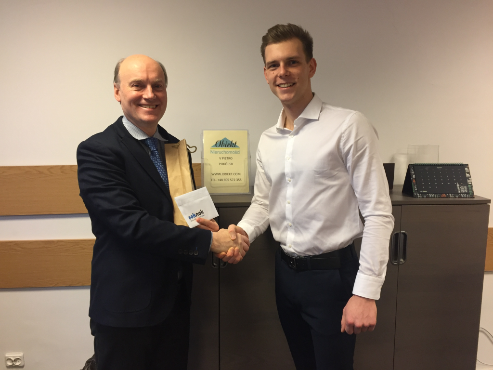

Title: Rozstrzygnięcie konkursu noknok.pl

Published: 2018-01-18

Tags:
- klient popytowy współpraca
- wyszukiwarka klientów
- statystyki
- konkurs
---

Rozstrzygnięcie konkursu noknok.pl
-------------------------------------------------------------
Gratulujemy panu Januszowi z agencji Obiekt Nieruchomości Janusz Pańczyk wygranej w naszym konkursie.

Zwycięzca otrzymał 1,000 zł oraz butelkę szampana za wskazanie najbardziej oraz najmniej popularniej dzielnicy Krakowa wśród klientów [noknok.pl](http://noknok.pl/) zgodnie z danymi z ostatniego kwartału.

Nagrodę wręczył nasz Specjalista ds. Klienta, Mateusz Gawlak.

Jeśli chcesz zapoznać się ze statystykami z czwartego kwartału 2017 roku, możesz to zrobić [tutaj](https://blog.noknok.pl/posts/statystyki%20klientow%20z%20iv%20kwartalu%202017%20r) lub zalogować się na swoje konto firmowe [noknok.pl](http://noknok.pl/) i przejść do zakładki Statystyki.

Dziękujemy wszystkim uczestnikom konkursu i jeszcze raz gratulujemy zwycięzcy!

{.img-fluid .img-responsive}

