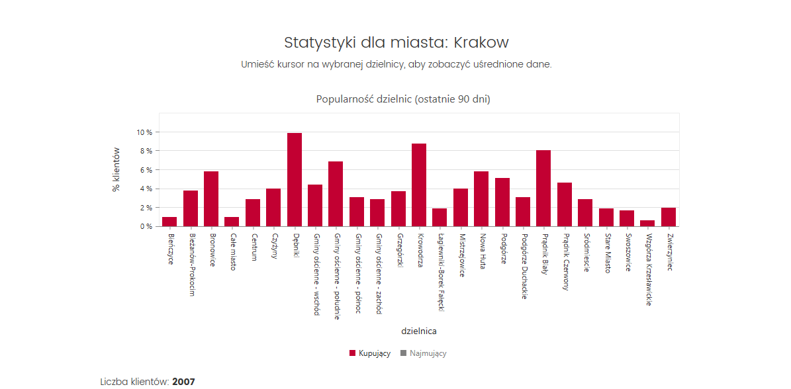
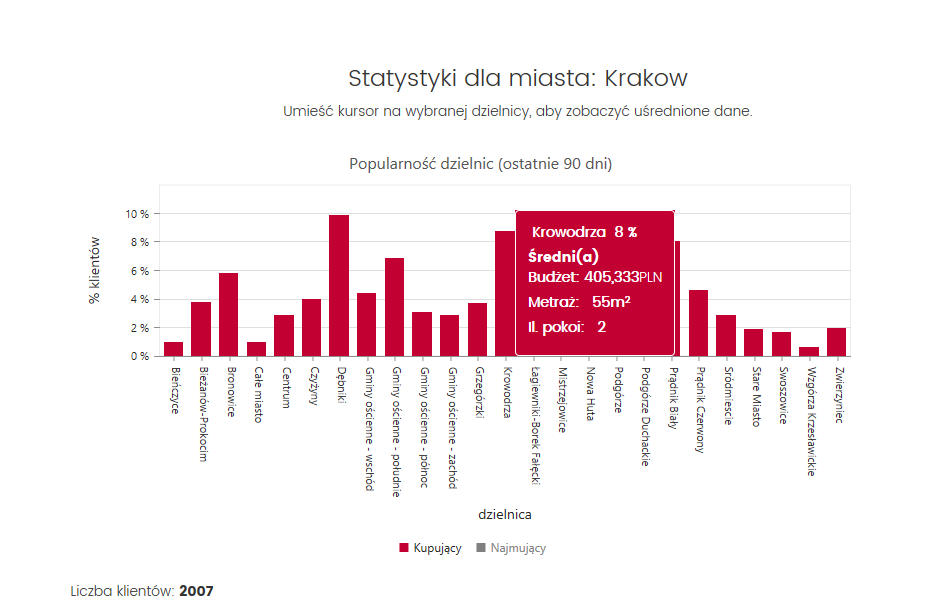

Title: Statystyki klientów z IV kwartału 2017 r.

Published: 2018-01-18

Tags:
- klient popytowy współpraca
- wyszukiwarka klientów
- statystyki
---

Czego szuka klient kupujący w Krakowie? Podsumowanie kwartału IV 2017 r.
-------------------------------------------------------------
W dzisiejszym poście chcemy podzielić się z Wami statystykami [noknok.pl](http://noknok.pl/) z ostatniego kwartału 2017 r.

Analizując blisko dwa tysiące ofert klientów szukających nieruchomości do kupienia lub wynajęcia w Krakowie, jesteśmy w stanie określić czego dokładnie szukają klienci, które dzielnice miasta preferują i jakim dysponują budżetem.

Poniżej szczegóły dotyczące najpopularniejszej dzielnicy Krakowa, a więcej danych znajdziecie w zakładce Statysyki po zalogowaniu się na swoje konto [noknok.pl](http://noknok.pl/).

{.img-fluid .img-responsive}

## Top-dzielnica

Najbardziej pożądaną dzielnicą Krakowa dla klientów kupujących z noknok.pl jest Krowodrza, gdzie klienci szukają 2-pokojowych mieszkań ok. 54m2 w budżecie 401,000 PLN. Przeciętny klient chce zapłacić 7,400 PLN/m2 i preferuje lokum z balkonem. 

Prawie wszyscy klienci poszukują miejsc postojowych lub garażu.

{.img-fluid .img-responsive}

Zbliżony trend oraz budżet dotyczy dzielnic takich jak: Prądnik Biały oraz Dębniki. 

Każdego dnia przez agentów dodawane są nowe oferty popytowe, a dane statystyczne dla dzielnic ulegają zmianom. Z dniem 15 stycznia 2018 r. Dębniki pobiły Krowodrzę w popularności. 

----------

Aby uzyskać dostęp do pełnych statystyk i stać się częścią dynamicznie rozwijającej się sieci agentów współpracujących przez [noknok.pl](http://noknok.pl/), załóż konto swojej agencji i korzystaj z naszych usług za darmo. 
